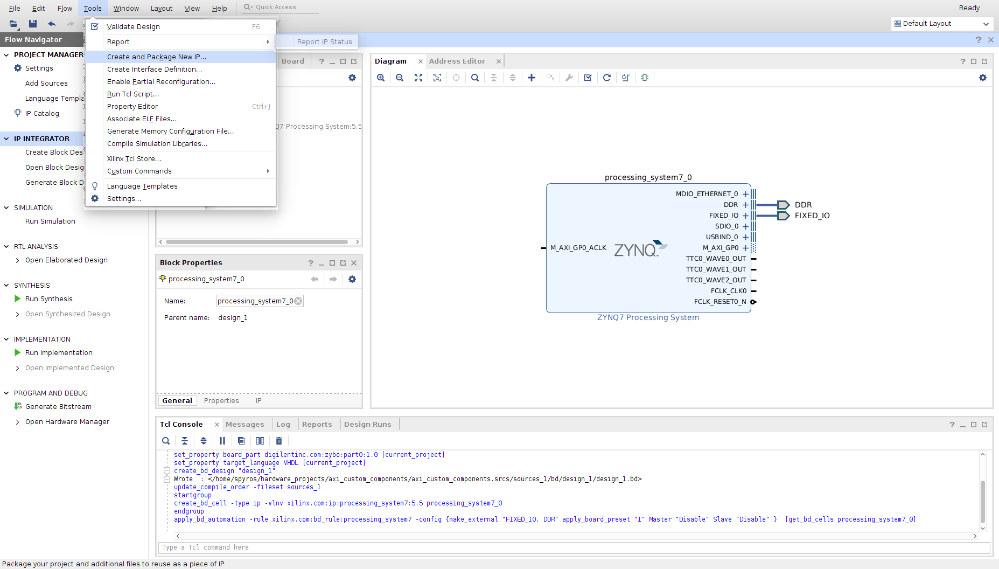
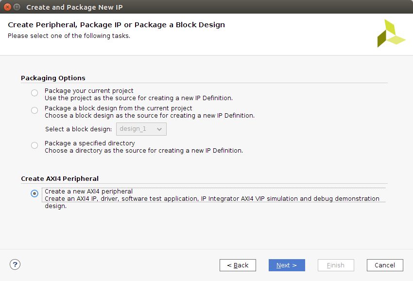

This tutorial goes through the design, verification and integration of a custom component - in our example a simple adder - to the slave AXI-lite interface in Vivado. The tools used are:

* Vivado/SDK 2017.4 Design Edition
* [ZyBo](https://reference.digilentinc.com/reference/programmable-logic/zybo/start) FPGA

So, we open Vivado and start a new project and select the board part you use. In my case it's ....
Next we need to generate a CPU diagram. The CPU can be a <i>Microblaze</i> or <i>Zynq</i>  

After this is done we proceed to create an AXI-lite interface. Go to:

```
Tools -> Create and Package New IP...
```



Here we see the write process of the Slave AXI-lite. 
<div class="highlight">
<pre>
  <code class="VHDL">process (S_AXI_ACLK)
  variable loc_addr : std_logic_vector(OPT_MEM_ADDR_BITS downto 0); 
begin
  if rising_edge(S_AXI_ACLK) then 
    if S_AXI_ARESETN = '0' then
      slv_reg0 <= (others => '0');
      slv_reg1 <= (others => '0');
      slv_reg2 <= (others => '0');
      slv_reg3 <= (others => '0');
    else
      loc_addr := axi_awaddr(ADDR_LSB + OPT_MEM_ADDR_BITS downto ADDR_LSB);
      if (slv_reg_wren = '1') then
        case loc_addr is
          when b"00" => 
            for byte_index in 0 to (C_S_AXI_DATA_WIDTH/8-1) loop
              if ( S_AXI_WSTRB(byte_index) = '1' ) then
                -- Respective byte enables are asserted as per write strobes
                -- slave registor 0
                slv_reg0(byte_index*8+7 downto byte_index*8) <= S_AXI_WDATA(byte_index*8+7 downto byte_index*8);
              end if;
            end loop;
          when b"01" => 
            for byte_index in 0 to (C_S_AXI_DATA_WIDTH/8-1) loop
              if ( S_AXI_WSTRB(byte_index) = '1' ) then
                -- Respective byte enables are asserted as per write strobes
                -- slave registor 1
                slv_reg1(byte_index*8+7 downto byte_index*8) <= S_AXI_WDATA(byte_index*8+7 downto byte_index*8);
              end if;
            end loop;
          when b"10" => 
            for byte_index in 0 to (C_S_AXI_DATA_WIDTH/8-1) loop
              if ( S_AXI_WSTRB(byte_index) = '1' ) then
                -- Respective byte enables are asserted as per write strobes
                -- slave registor 2
                slv_reg2(byte_index*8+7 downto byte_index*8) <= S_AXI_WDATA(byte_index*8+7 downto byte_index*8);
              end if;
            end loop;
          when b"11" => 
            for byte_index in 0 to (C_S_AXI_DATA_WIDTH/8-1) loop
              if ( S_AXI_WSTRB(byte_index) = '1' ) then
                -- Respective byte enables are asserted as per write strobes
                -- slave registor 3
                slv_reg3(byte_index*8+7 downto byte_index*8) <= S_AXI_WDATA(byte_index*8+7 downto byte_index*8);
              end if;
            end loop;
          when others => 
            slv_reg0 <= slv_reg0;
            slv_reg1 <= slv_reg1;
            slv_reg2 <= slv_reg2;
            slv_reg3 <= slv_reg3;
        end case;
      end if;
    end if;
  end if; 
end process; </code>
</pre>
</div>
What we can see is a number of registers that the data are written to (__slv_reg0__ to __slv_reg3__).
The location for the data to be written are chosen from the address the developer choose to write to.
The way to decipher this address is from the case statement from (__00__ to __11__). What those 2 bits dictate
is the offset of the address that the developer choose to read/write. Since we are byte addressing the
first 2 bits are discarded so the addressable areas are the following:

* b'**00**00 (0x0)
* b'**01**00 (0x4)
* b'**10**00 (0x8)
* b'**11**00 (0xC)

After the address decoding there is the strobe decoding. An example of what is a strobe is shown in the following table:

| Strobe 3 | Strobe 2 | Strobe 1 | Strobe 0 |
|----------|----------|----------|----------|
|0000\_0000|0000\_0000|0000\_0000| 0000_0000|

The S_AXI_WSTRB signal is 4 bits which by default is set to b'1111. If these bits are changed then the
values read are dependent on the value of the bits. If for example the value is b'0100 then we read only
Strobe 2 shown in the table.


Here we see the read process of the Slave AXI-lite. 
<div class="highlight">
<pre>
  <code class="VHDL">process (slv_reg0, slv_reg1, slv_reg2, slv_reg3, axi_araddr, S_AXI_ARESETN, slv_reg_rden)
  variable loc_addr : std_logic_vector(OPT_MEM_ADDR_BITS downto 0);
begin
  -- Address decoding for reading registers
  loc_addr := axi_araddr(ADDR_LSB + OPT_MEM_ADDR_BITS downto ADDR_LSB);
  case loc_addr is
    when b"00" => 
      reg_data_out <= slv_reg0;
    when b"01" => 
      reg_data_out <= slv_reg1;
    when b"10" => 
      reg_data_out <= slv_reg2;
    when b"11" => 
      reg_data_out <= slv_reg3;
    when others => 
      reg_data_out <= (others => '0');
  end case;
end process; </code>
</pre>
</div>
Following the previous example about how the addresses are decoded we see that whenever there is a read
we retrieve data depending on the address we chose to read.